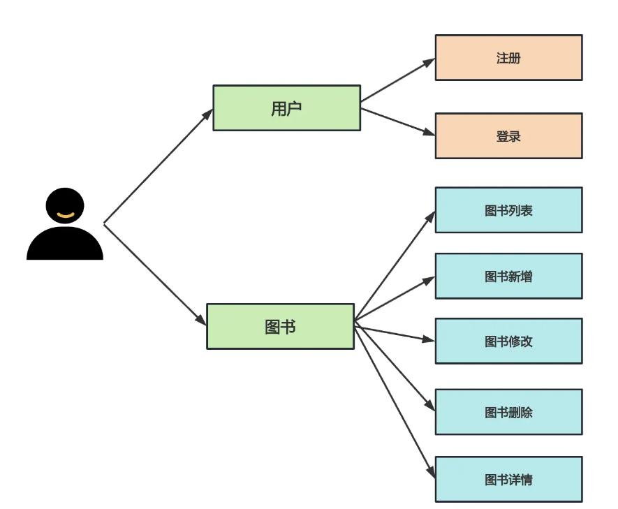

# README



## Installation

```bash
# Installation
$ npm install
```

## Running the app

```bash
# development
$ npm run start

# watch mode
$ npm run start:dev

# production mode
$ npm run start:prod
```

## links

- [https://docs.nestjs.com](https://docs.nestjs.com/)
- [https://juejin.cn](https://juejin.cn/book/7226988578700525605/section/7391332146377392164)
